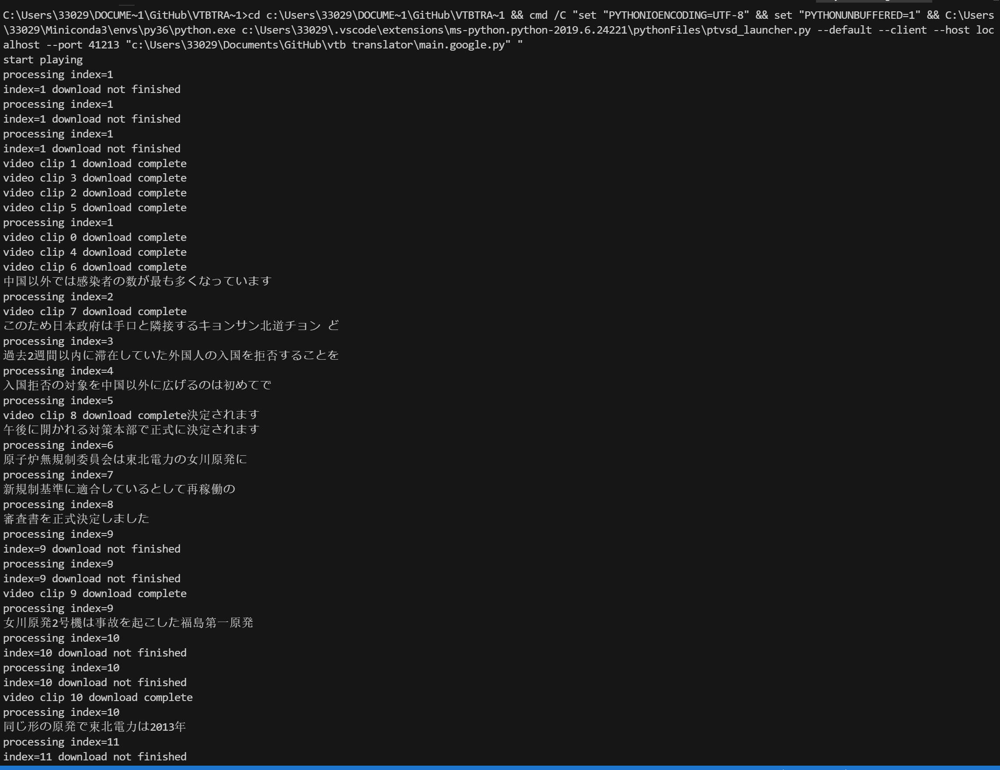

# 实时翻译油管直播
> 开发中 v0.01 别指望能用
## 计划
1. 实时获取油管直播 已实现   
   * 油管直播解析出来是一个m3u8链接，链接是不变的，每次get链接包含的videofile是会变的，建立一个file history存video file，然后多线程下载video file就可以了
2. 直播视频转音频 已实现
   * 使用moivepy视频转音频，使用librosa转音频码率 
   * moivepy打开的视频记得关掉，不然文件handle会报错
3. ~~音频分段提取语音部分 Voice Activation Detection 而且是online的 有点难~~ 丢给谷歌解决
   * 检测音频中语音 Voice Activation Detection
   * 因为是直播，后面新的音频还在源源不断进来，属于online检测 
4. 音频转文字 可以调的接口很多 这里用谷歌语音转文字（本来用IBM Waston但是IBM不支持流式识别，转谷歌
5. 文字翻译 可以调的接口也很多 准备Google Translate

## 效果
